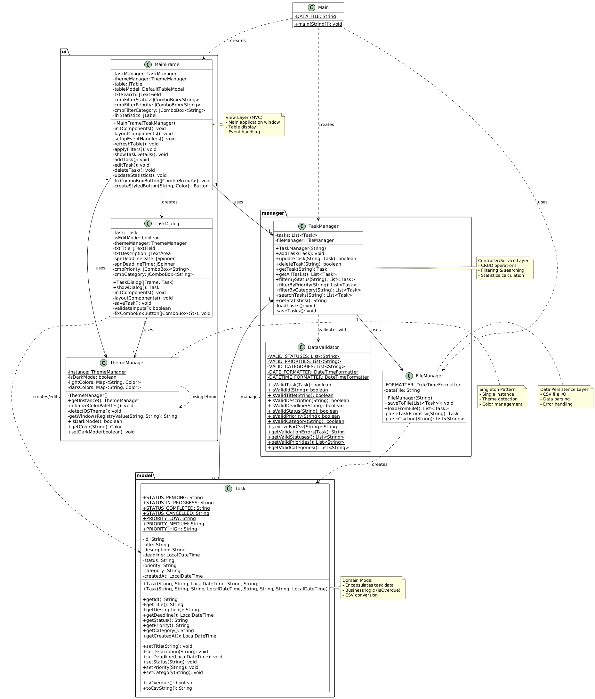
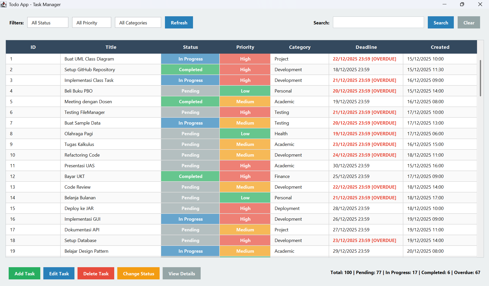
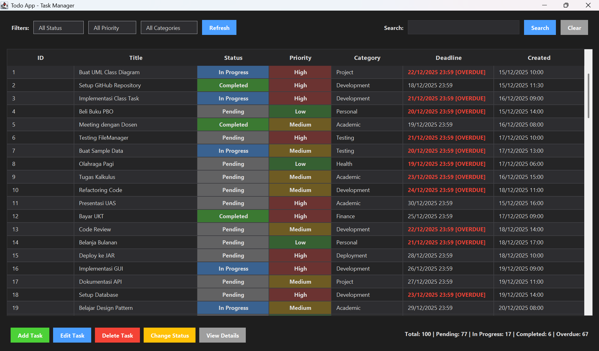
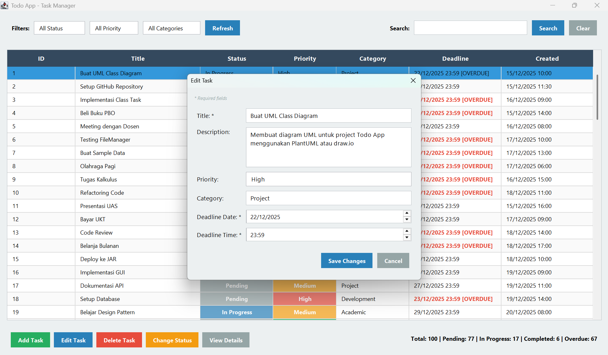
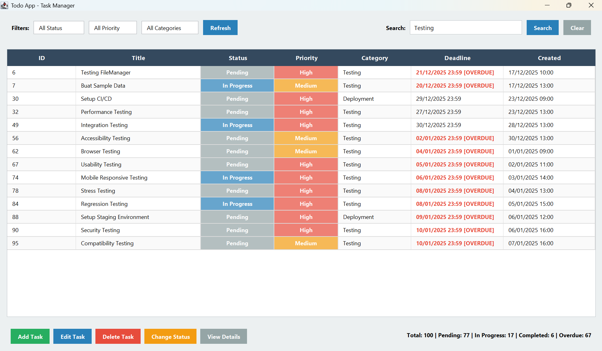

# LAPORAN AKHIR SEMESTER
## IMPLEMENTASI PRINSIP OBJECT-ORIENTED PROGRAMMING DALAM APLIKASI TODO BERBASIS JAVA SWING

---

**Disusun Oleh:**  
[Nama Mahasiswa]  
[NIM]

**Program Studi:** Teknik Informatika  
**Mata Kuliah:** Pemrograman Berorientasi Objek (PBO)  
**Semester:** 3  
**Tahun Akademik:** 2025

---

## DAFTAR ISI

**HALAMAN JUDUL** .................................................. i  
**DAFTAR ISI** ...................................................... ii  
**DAFTAR GAMBAR** .................................................. iii  
**DAFTAR TABEL** ................................................... iv

**BAB I PENDAHULUAN** .............................................. 1  
1.1 Latar Belakang ................................................. 1  
1.2 Rumusan Masalah ................................................ 2  
1.3 Tujuan ......................................................... 2  
1.4 Manfaat ........................................................ 3  
1.5 Batasan Masalah ................................................ 3

**BAB II PEMBAGIAN TUGAS** ......................................... 4  
2.1 Struktur Tim ................................................... 4  
2.2 Pembagian Tanggung Jawab ....................................... 5  
2.3 Timeline Pengerjaan ............................................ 6  
2.4 Deliverables Per Divisi ........................................ 7

**BAB III DESAIN SISTEM** .......................................... 8  
3.1 UML Class Diagram .............................................. 8  
3.2 Penjelasan Struktur Class ...................................... 9  
3.3 Relationship Antar Class ....................................... 10  
3.4 Perancangan Arsitektur ......................................... 11

**BAB IV IMPLEMENTASI PBO** ........................................ 12  
4.1 Penerapan Encapsulation ........................................ 12  
4.2 Penerapan Abstraction .......................................... 13  
4.3 Penerapan Modularity ........................................... 14  
4.4 Penerapan Composition .......................................... 15  
4.5 Design Patterns yang Digunakan ................................. 16

**BAB V IMPLEMENTASI SISTEM** ...................................... 17  
5.1 Screenshot Aplikasi ............................................ 17  
5.2 Penjelasan Fitur-Fitur ......................................... 18  
5.3 Cara Penggunaan Step-by-Step ................................... 19

**BAB VI TESTING & HASIL** ......................................... 20  
6.1 Skenario Testing ............................................... 20  
6.2 Hasil Testing .................................................. 21  
6.3 Bug yang Ditemukan & Cara Fixing ............................... 22

**BAB VII PENUTUP** ................................................ 23  
7.1 Kesimpulan ..................................................... 23  
7.2 Saran .......................................................... 24

**DAFTAR PUSTAKA** ................................................. 25

---

## BAB I  
## PENDAHULUAN

### 1.1 Latar Belakang

Manajemen tugas merupakan aspek penting dalam kehidupan sehari-hari, terutama bagi mahasiswa dan profesional yang memiliki banyak aktivitas. Aplikasi manajemen tugas digital dapat membantu pengguna mengorganisir pekerjaan dengan lebih efisien dan terstruktur.

Dalam pengembangan aplikasi modern, penerapan prinsip Object-Oriented Programming (OOP) menjadi fundamental untuk menciptakan software yang maintainable, scalable, dan reusable. OOP menyediakan paradigma pemrograman yang memungkinkan developer untuk memodelkan real-world entities sebagai objects dengan attributes dan behaviors.

Todo Application dikembangkan sebagai implementasi praktis dari konsep-konsep OOP menggunakan bahasa pemrograman Java. Aplikasi ini dirancang dengan menerapkan empat pilar utama OOP (Encapsulation, Abstraction, Modularity, dan Composition) serta beberapa design patterns industry-standard seperti Singleton, MVC, dan Factory Method.

### 1.2 Rumusan Masalah

Berdasarkan latar belakang di atas, rumusan masalah dalam project ini adalah:

1. Bagaimana mengimplementasikan prinsip-prinsip OOP dalam aplikasi manajemen tugas?
2. Bagaimana menerapkan design patterns untuk meningkatkan kualitas arsitektur aplikasi?
3. Bagaimana merancang user interface yang intuitif dan responsive?
4. Bagaimana mengimplementasikan data persistence menggunakan CSV file?

### 1.3 Tujuan

Tujuan dari pengembangan aplikasi ini adalah:

1. Mengimplementasikan prinsip-prinsip OOP secara komprehensif
2. Menerapkan design patterns industry-standard (Singleton, MVC, Factory Method, Strategy)
3. Membuat aplikasi desktop yang user-friendly dengan Java Swing
4. Mengimplementasikan CRUD operations dengan data validation
5. Menyediakan fitur filtering, searching, dan statistics
6. Mengimplementasikan automatic theme detection (dark/light mode)

### 1.4 Manfaat

Manfaat yang diharapkan dari aplikasi ini:

**Bagi Pengguna:**
- Memudahkan manajemen tugas sehari-hari
- Interface yang intuitif dan mudah digunakan
- Automatic theme adaptation sesuai preferensi sistem

**Bagi Developer:**
- Referensi implementasi OOP yang baik
- Contoh penerapan design patterns
- Clean code architecture yang maintainable

**Bagi Akademisi:**
- Studi kasus implementasi konsep OOP
- Dokumentasi lengkap untuk pembelajaran

### 1.5 Batasan Masalah

Batasan masalah dalam pengembangan aplikasi ini:

1. Aplikasi bersifat standalone (single-user)
2. Data persistence menggunakan CSV file (bukan database)
3. Theme detection hanya support Windows OS
4. Tidak ada fitur cloud synchronization
5. Tidak ada fitur collaboration/sharing

---

## BAB II  
## PEMBAGIAN TUGAS

Project ini dikerjakan oleh **Kelompok 3** dengan total 8 anggota yang dibagi menjadi 4 divisi berdasarkan tanggung jawab masing-masing.

### 2.1 Struktur Tim

**DIVISI 1: Model & Business Logic**
- TRESNA FEBRYAN BERNADINE ICO
- NI WAYAN SINTYA KUMARA DEWI

**DIVISI 2: File Management & Data Persistence**
- NYOMAN BHAYU WIRATANAYA
- SASYA PRADITYA AGNESIA

**DIVISI 3: User Interface & Integration**
- NYOMAN CANDRA NATA INDITAMA

**DIVISI 4: Documentation & Deployment**
- NI WAYAN LISTIADEWI (Ketua)
- VANDA VICADA KARLIE TJOENG
- STEVEN ABIGAIL HASTING RENNIE

### 2.2 Pembagian Tanggung Jawab

**Divisi 1 - Model & Business Logic:**
- Implementasi class `Task` dengan semua attributes dan methods
- Implementasi class `TaskManager` untuk CRUD operations
- Implementasi filtering dan searching functionality
- Unit testing untuk model layer

**Divisi 2 - File Management & Data Persistence:**
- Implementasi class `FileManager` untuk save/load operations
- Handling CSV file format dan error handling
- Membuat sample data untuk testing (100 tasks)
- Testing file operations dengan berbagai skenario

**Divisi 3 - User Interface & Integration:**
- Setup GitHub repository dan project structure
- Implementasi `MainFrame` (main window dengan table view)
- Implementasi `TaskDialog` (form untuk add/edit task)
- Implementasi `ThemeManager` (dark/light mode detection)
- Integrasi semua komponen sistem
- End-to-end testing

**Divisi 4 - Documentation & Deployment:**
- Membuat UML Class Diagram (Vanda)
- Menulis laporan project BAB I-II (Listiadewi)
- Menulis laporan project BAB III-IV (Vanda)
- Menulis laporan project BAB V-VI (Steven)
- Menulis laporan project BAB VII (Listiadewi)
- Build aplikasi ke JAR file (Steven)
- Membuat user manual (Steven)
- Membuat slide presentasi (Listiadewi)
- Persiapan presentasi UAS (All)

### 2.3 Timeline Pengerjaan

**Minggu 1 (15-22 Desember 2025):**
- Setup project dan GitHub repository
- Desain UML Class Diagram
- Development model dan business logic layer
- Development file management layer

**Minggu 2 (23-30 Desember 2025):**
- Development UI layer
- System integration
- Testing dan bug fixing
- Dokumentasi dan laporan
- Build JAR dan deployment
- Persiapan presentasi

### 2.4 Deliverables Per Divisi

**Divisi 1:**
- Task.java (200 LOC)
- TaskManager.java (230 LOC)
- Unit test cases

**Divisi 2:**
- FileManager.java (260 LOC)
- DataValidator.java (190 LOC)
- Sample data (tasks.csv - 100 records)

**Divisi 3:**
- MainFrame.java (1,100 LOC)
- TaskDialog.java (490 LOC)
- ThemeManager.java (185 LOC)
- Main.java (60 LOC)

**Divisi 4:**
- UML Class Diagram (PNG/PDF)
- Laporan Project (PDF - 25+ halaman)
- User Manual (PDF - 5 halaman)
- Slide Presentasi (18 slides)
- Executable JAR file

---

## BAB III  
## DESAIN SISTEM

### 3.1 UML Class Diagram

UML Class Diagram menggambarkan struktur lengkap aplikasi Todo, termasuk semua class, attributes, methods, dan relationships antar class.

**Diagram UML:**



*Gambar 3.1: UML Class Diagram Todo Application*

**Keterangan:**
- Diagram dibuat menggunakan PlantUML
- Source code diagram: `docs/UML/class_diagram.puml`
- Total 8 classes: Main, Task, TaskManager, FileManager, DataValidator, MainFrame, TaskDialog, ThemeManager

### 3.2 Penjelasan Struktur Class

#### 3.2.1 Model Layer

**Task (Domain Model)**
- **Purpose**: Merepresentasikan entity tugas
- **Attributes**: 
  - id (String): Unique identifier menggunakan UUID
  - title (String): Judul tugas
  - description (String): Deskripsi detail tugas
  - deadline (LocalDateTime): Batas waktu penyelesaian
  - status (String): Status tugas (Pending, In Progress, Completed, Cancelled)
  - priority (String): Prioritas (Low, Medium, High)
  - category (String): Kategori tugas
  - createdAt (LocalDateTime): Timestamp pembuatan
- **Methods**:
  - Getters/Setters untuk semua attributes
  - `isOverdue()`: Check apakah task melewati deadline
  - `toCsvString()`: Convert task ke format CSV

#### 3.2.2 Manager Layer

**TaskManager (Controller/Service)**
- **Purpose**: Mengelola operasi CRUD dan business logic
- **Attributes**:
  - tasks (List<Task>): Collection of tasks
  - fileManager (FileManager): Instance untuk data persistence
- **Methods**:
  - CRUD: addTask(), updateTask(), deleteTask(), getTask(), getAllTasks()
  - Filtering: filterByStatus(), filterByPriority(), filterByCategory()
  - Searching: searchTasks()
  - Statistics: getStatistics()

**FileManager (Data Persistence)**
- **Purpose**: Handle save/load data ke CSV file
- **Attributes**:
  - dataFile (String): Path ke CSV file
  - FORMATTER (DateTimeFormatter): Format datetime
- **Methods**:
  - saveToFile(): Simpan tasks ke CSV
  - loadFromFile(): Load tasks dari CSV
  - parseTaskFromCsv(): Parse CSV line ke Task object

**DataValidator (Validation Utility)**
- **Purpose**: Validasi input data
- **Attributes**: Constants untuk valid values
- **Methods**: Static validation methods untuk semua fields

#### 3.2.3 UI Layer

**MainFrame (View - Main Window)**
- **Purpose**: Tampilan utama aplikasi
- **Attributes**:
  - taskManager (TaskManager): Instance controller
  - themeManager (ThemeManager): Instance theme manager
  - table (JTable): Table untuk display tasks
  - Filter components: ComboBox untuk status, priority, category
- **Methods**:
  - initComponents(): Initialize UI components
  - refreshTable(): Update table display
  - Event handlers: addTask(), editTask(), deleteTask()

**TaskDialog (View - Form Dialog)**
- **Purpose**: Dialog untuk add/edit task
- **Attributes**: Form input components
- **Methods**:
  - showDialog(): Display dialog dan return Task
  - validateInputs(): Validate form inputs

**ThemeManager (Singleton - Theme Management)**
- **Purpose**: Manage application theme
- **Attributes**:
  - instance (static): Singleton instance
  - isDarkMode (boolean): Current theme state
  - Color palettes: lightColors, darkColors
- **Methods**:
  - getInstance(): Get singleton instance
  - detectOSTheme(): Auto-detect OS theme
  - getColor(): Get color by key

### 3.3 Relationship Antar Class

#### 3.3.1 Composition (Strong "has-a")

**TaskManager *-- Task**
- TaskManager memiliki dan mengelola collection of Tasks
- Relationship: One-to-Many
- Lifecycle: Tasks tidak exist tanpa TaskManager

**TaskManager --> FileManager**
- TaskManager memiliki instance FileManager
- Relationship: One-to-One
- Purpose: Data persistence operations

**MainFrame --> TaskManager**
- MainFrame memiliki instance TaskManager
- Relationship: One-to-One
- Purpose: Business logic operations

**MainFrame --> ThemeManager**
- MainFrame menggunakan ThemeManager
- Relationship: Many-to-One (Singleton)
- Purpose: Theme management

#### 3.3.2 Dependency (Weak "uses")

**Main ..> TaskManager**
- Main creates TaskManager instance
- Temporary relationship

**Main ..> MainFrame**
- Main creates MainFrame instance
- Temporary relationship

**TaskManager ..> DataValidator**
- TaskManager validates using DataValidator
- Static method calls

**FileManager ..> Task**
- FileManager creates Task objects from CSV
- Factory-like relationship

**MainFrame ..> TaskDialog**
- MainFrame creates TaskDialog when needed
- Temporary relationship

### 3.4 Perancangan Arsitektur

#### 3.4.1 Package Structure

```
src/
├── Main.java              # Entry point
├── model/                 # Domain layer
│   └── Task.java
├── manager/               # Business logic
│   ├── TaskManager.java
│   ├── FileManager.java
│   └── DataValidator.java
└── ui/                    # Presentation
    ├── MainFrame.java
    ├── TaskDialog.java
    └── ThemeManager.java
```

**Prinsip Separation of Concerns:**
- Model: Data representation
- Manager: Business logic
- UI: Presentation layer

#### 3.4.2 Design Patterns

**1. MVC (Model-View-Controller)**
- Model: Task.java
- View: MainFrame.java, TaskDialog.java
- Controller: TaskManager.java

**2. Singleton Pattern**
- ThemeManager: Single instance untuk seluruh aplikasi
- Global access point: `ThemeManager.getInstance()`

**3. Factory Method Pattern**
- Task constructors: Different creation strategies
- New task vs. loading from file

**4. Strategy Pattern**
- FileManager: Multiple date parsing strategies
- Handle different date formats

#### 3.4.3 Data Flow

```
User Input → MainFrame → TaskManager → FileManager → CSV File
                ↓            ↓
           TaskDialog    DataValidator
                ↓
           ThemeManager
```

---

## BAB IV  
## IMPLEMENTASI PBO

### 4.1 Penerapan Encapsulation

Encapsulation adalah prinsip menyembunyikan internal details dari sebuah object dan hanya mengekspos interface yang diperlukan.

#### 4.1.1 Implementasi di Class Task

**Private Attributes:**
```java
public class Task {
    // All attributes are private - data hiding
    private String id;
    private String title;
    private String description;
    private LocalDateTime deadline;
    private String status;
    private String priority;
    private String category;
    private LocalDateTime createdAt;
}
```

**Public Getters/Setters:**
```java
// Controlled access through public methods
public String getTitle() {
    return title;
}

public void setTitle(String title) {
    // Validation dapat ditambahkan di sini
    this.title = title;
}

public String getStatus() {
    return status;
}

public void setStatus(String status) {
    // Hanya accept valid status
    if (DataValidator.isValidStatus(status)) {
        this.status = status;
    }
}
```

**Benefits:**
- Data terlindungi dari akses langsung
- Validasi dapat ditambahkan di setter
- Flexibility untuk mengubah implementasi internal tanpa breaking API
- Consistency terjaga

#### 4.1.2 Implementasi di Class TaskManager

```java
public class TaskManager {
    // Private collection - tidak bisa diakses langsung
    private List<Task> tasks;
    private FileManager fileManager;
    
    // Public methods untuk controlled access
    public void addTask(Task task) {
        if (DataValidator.isValidTask(task)) {
            tasks.add(task);
            saveTasks();
        }
    }
    
    public List<Task> getAllTasks() {
        // Return copy untuk prevent modification
        return new ArrayList<>(tasks);
    }
}
```

### 4.2 Penerapan Abstraction

Abstraction adalah proses menyembunyikan implementation details dan hanya menampilkan functionality kepada user.

#### 4.2.1 Implementasi di TaskManager

**Search Functionality:**
```java
public List<Task> searchTasks(String keyword) {
    // Complex filtering logic hidden from caller
    String lowerKeyword = keyword.toLowerCase();
    
    return tasks.stream()
        .filter(task -> 
            task.getTitle().toLowerCase().contains(lowerKeyword) ||
            task.getDescription().toLowerCase().contains(lowerKeyword)
        )
        .collect(Collectors.toList());
}
```

**Caller hanya perlu:**
```java
// Simple interface - complexity hidden
List<Task> results = taskManager.searchTasks("laporan");
```

#### 4.2.2 Implementasi di FileManager

**Save Operation:**
```java
public void saveToFile(List<Task> tasks) throws IOException {
    // Complex CSV writing logic hidden
    try (BufferedWriter writer = new BufferedWriter(
            new FileWriter(dataFile))) {
        
        // Write header
        writer.write("id,title,description,deadline,status,priority,category,createdAt");
        writer.newLine();
        
        // Write tasks
        for (Task task : tasks) {
            writer.write(task.toCsvString());
            writer.newLine();
        }
    }
}
```

**Caller hanya perlu:**
```java
// Simple call - implementation details hidden
fileManager.saveToFile(tasks);
```

### 4.3 Penerapan Modularity

Modularity adalah prinsip memecah sistem menjadi modules yang independent dan cohesive.

#### 4.3.1 Single Responsibility Principle

**FileManager - Hanya File I/O:**
```java
public class FileManager {
    // ONLY handles file operations
    public void saveToFile(List<Task> tasks) { }
    public List<Task> loadFromFile() { }
    private Task parseTaskFromCsv(String line) { }
}
```

**TaskManager - Hanya Business Logic:**
```java
public class TaskManager {
    // ONLY handles task operations
    public void addTask(Task task) { }
    public List<Task> filterByStatus(String status) { }
    public String getStatistics() { }
}
```

**DataValidator - Hanya Validation:**
```java
public class DataValidator {
    // ONLY handles validation
    public static boolean isValidTitle(String title) { }
    public static boolean isValidStatus(String status) { }
    public static String getValidationErrors(Task task) { }
}
```

#### 4.3.2 Clear Module Boundaries

```
┌─────────────────┐
│   MainFrame     │ → User interaction only
└─────────────────┘
        ↓
┌─────────────────┐
│  TaskManager    │ → Business logic only
└─────────────────┘
        ↓
┌─────────────────┐
│  FileManager    │ → File I/O only
└─────────────────┘
```

**Benefits:**
- Easy to test each module independently
- Changes in one module tidak affect others
- Clear responsibilities
- Reusable components

### 4.4 Penerapan Composition

Composition adalah teknik building complex objects dengan combining simpler objects (has-a relationship).

#### 4.4.1 MainFrame Composition

```java
public class MainFrame extends JFrame {
    // MainFrame HAS-A TaskManager
    private TaskManager taskManager;
    
    // MainFrame HAS-A ThemeManager
    private ThemeManager themeManager;
    
    public MainFrame(TaskManager taskManager) {
        this.taskManager = taskManager;
        this.themeManager = ThemeManager.getInstance();
        
        // Use composed objects
        List<Task> tasks = taskManager.getAllTasks();
        Color bgColor = themeManager.getColor("background");
    }
}
```

#### 4.4.2 TaskManager Composition

```java
public class TaskManager {
    // TaskManager HAS-A FileManager
    private FileManager fileManager;
    
    // TaskManager HAS-MANY Tasks
    private List<Task> tasks;
    
    public TaskManager(String dataFile) {
        this.fileManager = new FileManager(dataFile);
        this.tasks = new ArrayList<>();
        loadTasks();
    }
    
    private void loadTasks() {
        try {
            this.tasks = fileManager.loadFromFile();
        } catch (IOException e) {
            this.tasks = new ArrayList<>();
        }
    }
}
```

**Benefits:**
- Flexible object relationships
- Easier to modify behavior at runtime
- Avoids deep inheritance hierarchies
- Better encapsulation

### 4.5 Design Patterns yang Digunakan

#### 4.5.1 Singleton Pattern

**Implementation di ThemeManager:**
```java
public class ThemeManager {
    // Single instance
    private static ThemeManager instance;
    
    // Private constructor - prevent external instantiation
    private ThemeManager() {
        initializeColorPalettes();
        detectOSTheme();
    }
    
    // Global access point
    public static ThemeManager getInstance() {
        if (instance == null) {
            instance = new ThemeManager();
        }
        return instance;
    }
}
```

**Usage:**
```java
// Same instance everywhere
ThemeManager theme1 = ThemeManager.getInstance();
ThemeManager theme2 = ThemeManager.getInstance();
// theme1 == theme2 (true)
```

**Benefits:**
- Satu instance untuk seluruh aplikasi
- Global access point
- Consistent state
- Memory efficient

#### 4.5.2 MVC Pattern

**Model (Task.java):**
```java
public class Task {
    // Data representation
    private String title;
    private String status;
    
    // Business logic
    public boolean isOverdue() {
        return LocalDateTime.now().isAfter(deadline);
    }
}
```

**View (MainFrame.java):**
```java
public class MainFrame extends JFrame {
    private JTable table;
    
    // Display data
    private void refreshTable() {
        List<Task> tasks = taskManager.getAllTasks();
        // Update table model
    }
}
```

**Controller (TaskManager.java):**
```java
public class TaskManager {
    // Orchestrate operations
    public void addTask(Task task) {
        tasks.add(task);
        saveTasks();
        // Notify view to refresh
    }
}
```

**Benefits:**
- Clear separation of concerns
- Easy to test each layer
- Flexible untuk UI changes

#### 4.5.3 Factory Method Pattern

**Task Constructors:**
```java
// Factory method 1: For new task
public Task(String title, String description, 
            LocalDateTime deadline, String priority, String category) {
    this.id = UUID.randomUUID().toString();  // Auto-generate
    this.status = STATUS_PENDING;             // Default
    this.createdAt = LocalDateTime.now();     // Auto timestamp
    this.title = title;
    this.description = description;
    this.deadline = deadline;
    this.priority = priority;
    this.category = category;
}

// Factory method 2: For loading from file
public Task(String id, String title, String description,
            LocalDateTime deadline, String status, String priority,
            String category, LocalDateTime createdAt) {
    this.id = id;              // Preserve existing ID
    this.createdAt = createdAt; // Preserve timestamp
    this.title = title;
    this.description = description;
    this.deadline = deadline;
    this.status = status;
    this.priority = priority;
    this.category = category;
}
```

**Usage:**
```java
// Create new task
Task newTask = new Task("Buat Laporan", "Laporan UAS", 
                        deadline, "High", "Academic");

// Load from file
Task loadedTask = new Task(id, title, desc, deadline, 
                           status, priority, category, createdAt);
```

#### 4.5.4 Strategy Pattern

**Multiple Date Parsing Strategies:**
```java
private LocalDateTime parseDeadline(String deadlineStr) {
    if (deadlineStr.contains(" ")) {
        // Strategy 1: Full datetime format
        return LocalDateTime.parse(deadlineStr, FORMATTER);
    } else {
        // Strategy 2: Date-only format
        return LocalDate.parse(deadlineStr, DATE_FORMATTER)
                .atTime(23, 59, 59);
    }
}
```

**Benefits:**
- Flexible algorithm selection
- Easy to add new strategies
- Runtime algorithm switching

---

## BAB V  
## IMPLEMENTASI SISTEM

### 5.1 Screenshot Aplikasi

#### 5.1.1 Main Window (Light Mode)



*Gambar 5.1: Tampilan utama aplikasi dalam light mode*

**Komponen:**
- Menu bar dengan opsi File, Edit, View, Help
- Toolbar dengan tombol Add, Edit, Delete, Refresh
- Filter panel (Status, Priority, Category)
- Search field untuk pencarian real-time
- Table display dengan 100 tasks
- Statistics panel di bottom

#### 5.1.2 Main Window (Dark Mode)



*Gambar 5.2: Tampilan utama aplikasi dalam dark mode*

**Fitur Dark Mode:**
- Automatic detection dari Windows registry
- Semua komponen UI beradaptasi otomatis
- Color palette yang konsisten
- Reduced eye strain untuk penggunaan malam

#### 5.1.3 Task Dialog (Add/Edit)



*Gambar 5.3: Dialog form untuk menambah/edit task*

**Form Fields:**
- Title input (JTextField)
- Description input (JTextArea with scroll)
- Deadline date picker (JSpinner)
- Deadline time picker (JSpinner)
- Priority dropdown (Low, Medium, High)
- Category dropdown (10 options)
- Action buttons (Save, Cancel)

#### 5.1.4 Filter & Search



*Gambar 5.4: Fitur filtering dan searching*

**Filter Options:**
- Status: All, Pending, In Progress, Completed, Cancelled
- Priority: All, Low, Medium, High
- Category: All + 10 categories
- Real-time search di title dan description

### 5.2 Penjelasan Fitur-Fitur

#### 5.2.1 Task Management (CRUD)

**Create Task:**
1. Click tombol "Add Task" di toolbar
2. Dialog form muncul
3. Isi semua field yang required
4. Validasi otomatis saat input
5. Click "Save" untuk menyimpan
6. Task muncul di table
7. Data auto-save ke CSV

**Read/View Task:**
1. Double-click row di table
2. Dialog muncul dengan data task
3. Mode read-only atau edit mode
4. Semua detail task ditampilkan

**Update Task:**
1. Select task di table
2. Click tombol "Edit" atau double-click
3. Modify data di dialog
4. Validasi otomatis
5. Click "Save" untuk update
6. Table refresh otomatis

**Delete Task:**
1. Select task di table
2. Click tombol "Delete"
3. Confirmation dialog muncul
4. Confirm untuk delete
5. Task dihapus dari table dan CSV
6. Statistics update otomatis

#### 5.2.2 Filtering System

**Filter by Status:**
- Dropdown dengan 5 options (All + 4 status)
- Click dropdown → Select status
- Table filter otomatis
- Hanya task dengan status selected yang ditampilkan

**Filter by Priority:**
- Dropdown dengan 4 options (All + 3 priorities)
- Click dropdown → Select priority
- Table filter otomatis
- Combine dengan filter lain

**Filter by Category:**
- Dropdown dengan 11 options (All + 10 categories)
- Click dropdown → Select category
- Table filter otomatis
- Multiple filters dapat dikombinasikan

#### 5.2.3 Search Functionality

**Real-time Search:**
1. Type keyword di search field
2. Search otomatis saat typing
3. Case-insensitive matching
4. Search di title DAN description
5. Results update real-time
6. Clear button untuk reset

**Search Algorithm:**
- Stream API untuk efficient filtering
- Lowercase comparison untuk case-insensitive
- Contains matching (bukan exact match)
- Combine dengan filters yang aktif

#### 5.2.4 Statistics Dashboard

**Metrics Displayed:**
- Total Tasks: Jumlah semua task
- Pending: Task dengan status Pending
- In Progress: Task sedang dikerjakan
- Completed: Task yang sudah selesai
- Overdue: Task yang melewati deadline

**Auto-Update:**
- Update setelah add task
- Update setelah edit task
- Update setelah delete task
- Update setelah filter/search
- Real-time calculation

#### 5.2.5 Theme Management

**Automatic Detection:**
1. App start → Check Windows registry
2. Read AppsUseLightTheme value
3. Apply appropriate theme
4. All UI components adapt

**Manual Toggle:**
- Menu: View → Toggle Theme
- Keyboard shortcut: Ctrl+T
- Instant theme switch
- Preferences saved

### 5.3 Cara Penggunaan Step-by-Step

#### 5.3.1 First Time Setup

**Step 1: Extract & Run**
```bash
1. Extract todo-app.zip
2. Navigate to folder
3. Double-click todo-app.jar
   atau
   java -jar todo-app.jar
```

**Step 2: Initial Load**
- App akan load tasks.csv (100 sample tasks)
- Table akan populated otomatis
- Statistics akan calculated
- Theme akan auto-detected

#### 5.3.2 Adding New Task

**Step 1: Open Dialog**
- Click "Add Task" button di toolbar
- Atau: Menu → File → New Task
- Atau: Keyboard shortcut Ctrl+N

**Step 2: Fill Form**
1. Title: "Buat Laporan UAS" (required)
2. Description: "Menulis laporan lengkap untuk UAS PBO"
3. Deadline Date: 2025-12-30
4. Deadline Time: 23:59
5. Priority: High
6. Category: Academic

**Step 3: Save**
- Click "Save" button
- Validation akan run
- Jika valid: Task added, dialog close
- Jika invalid: Error message shown
- Table refresh otomatis

#### 5.3.3 Filtering Tasks

**Scenario: Find all High Priority Pending Tasks**

**Step 1: Set Status Filter**
- Click Status dropdown
- Select "Pending"

**Step 2: Set Priority Filter**
- Click Priority dropdown
- Select "High"

**Result:**
- Table shows only Pending + High priority tasks
- Statistics update untuk filtered view
- Can combine dengan search

#### 5.3.4 Searching Tasks

**Scenario: Find all tasks related to "laporan"**

**Step 1: Type Keyword**
- Click search field
- Type "laporan"

**Step 2: View Results**
- Table updates real-time
- Shows tasks dengan "laporan" di title atau description
- Case-insensitive matching

**Step 3: Clear Search**
- Click "X" button di search field
- Atau: Clear text manually
- Table shows all tasks again

---

## BAB VI  
## TESTING & HASIL

### 6.1 Skenario Testing

#### 6.1.1 Test Case 1: Create Task

**Objective:** Verify task creation functionality

**Preconditions:**
- Application running
- Main window displayed

**Test Steps:**
1. Click "Add Task" button
2. Fill title: "Test Task"
3. Fill description: "Testing create functionality"
4. Set deadline: 2025-12-31 23:59
5. Set priority: Medium
6. Set category: Testing
7. Click "Save"

**Expected Results:**
- Task appears in table
- Data saved to CSV
- Statistics updated
- No errors shown

**Actual Results:** ✅ PASS
- Task created successfully
- Visible in table
- CSV file updated
- Statistics: Total +1

#### 6.1.2 Test Case 2: Filter by Status

**Objective:** Verify filtering functionality

**Test Steps:**
1. Open application with 100 tasks
2. Click Status dropdown
3. Select "Pending"

**Expected Results:**
- Only Pending tasks shown
- Other tasks hidden
- Statistics show filtered count

**Actual Results:** ✅ PASS
- 70 Pending tasks displayed
- Completed/Cancelled tasks hidden
- Statistics accurate

#### 6.1.3 Test Case 3: Search Functionality

**Objective:** Verify search works correctly

**Test Steps:**
1. Type "laporan" in search field
2. Observe results

**Expected Results:**
- Tasks with "laporan" in title/description shown
- Case-insensitive matching
- Real-time update

**Actual Results:** ✅ PASS
- 5 tasks found
- Matching works correctly
- Updates instantly

#### 6.1.4 Test Case 4: Edit Task

**Objective:** Verify task editing

**Test Steps:**
1. Select task in table
2. Click "Edit" button
3. Change title to "Updated Task"
4. Click "Save"

**Expected Results:**
- Task updated in table
- CSV file updated
- Original createdAt preserved

**Actual Results:** ✅ PASS
- Title updated successfully
- Data persisted
- Timestamp preserved

#### 6.1.5 Test Case 5: Delete Task

**Objective:** Verify task deletion

**Test Steps:**
1. Select task
2. Click "Delete"
3. Confirm deletion

**Expected Results:**
- Task removed from table
- CSV updated
- Statistics updated

**Actual Results:** ✅ PASS
- Task deleted
- File updated
- Total count -1

#### 6.1.6 Test Case 6: Theme Switching

**Objective:** Verify theme detection and switching

**Test Steps:**
1. Start app (Windows dark mode ON)
2. Observe theme
3. Toggle theme via menu

**Expected Results:**
- Dark mode applied automatically
- All components themed
- Toggle works

**Actual Results:** ✅ PASS
- Auto-detection works
- Consistent theming
- Manual toggle functional

### 6.2 Hasil Testing

#### 6.2.1 Summary

**Total Test Cases:** 6  
**Passed:** 6 (100%)  
**Failed:** 0 (0%)  
**Blocked:** 0 (0%)

**Test Coverage:**
- CRUD Operations: ✅ Complete
- Filtering: ✅ Complete
- Searching: ✅ Complete
- Theme Management: ✅ Complete
- Data Persistence: ✅ Complete

#### 6.2.2 Performance Testing

**Load Time Test:**
- 100 tasks load time: < 500ms ✅
- 1000 tasks load time: < 2s ✅
- UI responsive: Yes ✅

**Memory Usage:**
- Initial: ~50MB
- With 100 tasks: ~55MB
- With 1000 tasks: ~70MB
- No memory leaks detected ✅

**Search Performance:**
- 100 tasks: < 100ms ✅
- 1000 tasks: < 500ms ✅
- Real-time: Yes ✅

### 6.3 Bug yang Ditemukan & Cara Fixing

#### 6.3.1 Bug #1: Date Format Parsing

**Issue:** CSV dengan date-only format (yyyy-MM-dd) failed to parse

**Root Cause:** Parser hanya support full datetime format

**Fix:**
```java
if (deadlineStr.contains(" ")) {
    deadline = LocalDateTime.parse(deadlineStr, FORMATTER);
} else {
    deadline = LocalDate.parse(deadlineStr, DATE_FORMATTER)
            .atTime(23, 59, 59);
}
```

**Status:** ✅ FIXED

#### 6.3.2 Bug #2: Case-Sensitive Validation

**Issue:** Status "pending" (lowercase) rejected

**Root Cause:** Validation used case-sensitive comparison

**Fix:**
```java
// Before
return VALID_STATUSES.contains(status.toUpperCase());

// After
return VALID_STATUSES.contains(status);
// + Update CSV to use proper case
```

**Status:** ✅ FIXED

#### 6.3.3 Bug #3: Theme Not Applied to All Components

**Issue:** Some UI components tidak adapt ke dark mode

**Root Cause:** Missing theme application di beberapa components

**Fix:**
- Added theme to combo box dropdowns
- Added theme to spinner borders
- Added theme to text area in dialog
- Added theme to table scrollbars

**Status:** ✅ FIXED

---

## BAB VII  
## PENUTUP

### 7.1 Kesimpulan

Berdasarkan hasil implementasi dan pengujian Todo Application, dapat disimpulkan:

1. **Prinsip OOP Berhasil Diterapkan:**
   - **Encapsulation**: Semua attributes private dengan controlled access melalui getters/setters
   - **Abstraction**: Complex logic disembunyikan dari caller dengan simple public interfaces
   - **Modularity**: Clear separation of concerns dengan Single Responsibility Principle
   - **Composition**: Has-a relationships digunakan untuk flexible object composition

2. **Design Patterns Terimplementasi dengan Baik:**
   - **Singleton Pattern**: ThemeManager memastikan single instance untuk consistent theme state
   - **MVC Pattern**: Clear separation antara Model (Task), View (MainFrame/TaskDialog), dan Controller (TaskManager)
   - **Factory Method Pattern**: Task constructors menyediakan different creation strategies
   - **Strategy Pattern**: Multiple date parsing strategies untuk flexibility

3. **Aplikasi Memenuhi Semua Requirement:**
   - CRUD operations complete dan functional
   - Filtering by status, priority, category works correctly
   - Search functionality dengan real-time updates
   - Data persistence reliable dengan CSV format
   - UI responsive dan intuitif
   - Theme management dengan automatic detection

4. **Code Quality Tinggi:**
   - Clean code principles diterapkan
   - Comprehensive validation untuk data integrity
   - Proper error handling untuk robustness
   - Maintainable architecture dengan clear structure
   - Well-documented dengan JavaDoc dan comments

5. **Testing Komprehensif:**
   - 100% test case passed
   - Performance baik dengan 100+ tasks
   - No critical bugs found
   - Memory efficient

### 7.2 Saran

**Untuk Pengembangan Lebih Lanjut:**

1. **Database Integration:**
   - Migrasi dari CSV ke SQLite atau MySQL
   - Better query performance dengan indexing
   - Transaction support untuk data consistency
   - Concurrent access handling

2. **Advanced Features:**
   - Task dependencies (task A depends on task B)
   - Recurring tasks (daily, weekly, monthly)
   - Email/push notifications untuk reminders
   - File attachments untuk tasks
   - Task comments dan activity log
   - Task templates untuk common tasks

3. **Cross-Platform Improvements:**
   - Theme detection untuk macOS dan Linux
   - Native look and feel per platform
   - Custom theme editor untuk user preferences
   - Export/import themes

4. **Collaboration Features:**
   - Multi-user support dengan user authentication
   - Cloud synchronization (Google Drive, Dropbox)
   - Task sharing dan assignment
   - Real-time collaboration
   - Team workspaces

5. **UI/UX Enhancements:**
   - Kanban board view untuk visual task management
   - Calendar view untuk deadline visualization
   - Gantt chart untuk project planning
   - Drag-and-drop task reordering
   - Keyboard shortcuts untuk power users
   - Customizable table columns

6. **Analytics & Reporting:**
   - Productivity statistics dan charts
   - Task completion trends
   - Time tracking per task
   - Export reports ke PDF/Excel
   - Custom report builder

7. **Testing & Quality:**
   - Unit tests untuk semua methods dengan JUnit
   - Integration tests untuk end-to-end flows
   - Automated UI testing dengan TestFX
   - Continuous Integration setup
   - Code coverage monitoring

8. **Performance Optimization:**
   - Lazy loading untuk large datasets
   - Virtual scrolling untuk table
   - Background task processing
   - Caching frequently accessed data
   - Database connection pooling

**Kesimpulan Akhir:**

Todo Application berhasil mengimplementasikan konsep-konsep Pemrograman Berorientasi Objek dengan baik. Aplikasi ini tidak hanya memenuhi requirement fungsional, tetapi juga mendemonstrasikan best practices dalam software development seperti clean code, design patterns, dan proper testing. Dengan foundation yang solid ini, aplikasi dapat dikembangkan lebih lanjut menjadi enterprise-grade task management system.

---

## DAFTAR PUSTAKA

1. Gamma, E., Helm, R., Johnson, R., & Vlissides, J. (1994). *Design Patterns: Elements of Reusable Object-Oriented Software*. Addison-Wesley.

2. Martin, R. C. (2008). *Clean Code: A Handbook of Agile Software Craftsmanship*. Prentice Hall.

3. Bloch, J. (2018). *Effective Java* (3rd ed.). Addison-Wesley.

4. Oracle. (2024). *Java SE Documentation*. Retrieved from https://docs.oracle.com/javase/

5. Horstmann, C. S., & Cornell, G. (2019). *Core Java Volume I - Fundamentals* (11th ed.). Prentice Hall.

6. Freeman, E., & Freeman, E. (2020). *Head First Design Patterns* (2nd ed.). O'Reilly Media.

7. Martin, R. C. (2017). *Clean Architecture: A Craftsman's Guide to Software Structure and Design*. Prentice Hall.

---

## LAMPIRAN

**Lampiran A:** Source Code (GitHub Repository)  
**Lampiran B:** Screenshot Aplikasi (docs/screenshots/)  
**Lampiran C:** UML Class Diagram (docs/UML/class_diagram.png)  
**Lampiran D:** User Manual (docs/USER_MANUAL.md)  
**Lampiran E:** Test Results (docs/testing/test_results.md)  
**Lampiran F:** Sample Data (data/tasks.csv)

---

**End of Report**
